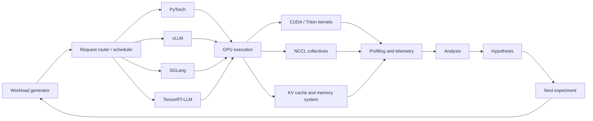

# GPU LLM Systems Lab

> A reproducible, profiler-driven laboratory for understanding and optimizing large-language-model inference across NVIDIA GPU architectures.

[](LICENSE)


## Research question

**How do GPU architecture, kernels, quantization, parallelism, and request scheduling affect LLM serving performance?**

This repository is a long-term systems portfolio built around one principle:

> A performance result is useful only when it is reproducible, correctly measured, and explained by the underlying hardware and software behavior.

The project is intentionally GPU-generation-aware rather than tied to one accelerator. Experiments may run on AWS `p4d` (A100), `p5`/`p5en` (H100/H200), `g6` (L4), local systems, or future CUDA-capable hardware. Every result must identify the exact machine, topology, software stack, workload, and measurement method.

## What this project will demonstrate

- GPU performance analysis with Nsight Systems and Nsight Compute
- Triton and CUDA/CUTLASS kernel development
- PyTorch, `torch.compile`, vLLM, SGLang, and TensorRT-LLM benchmarking
- Quantization measured by real latency and throughput—not model size alone
- Multi-GPU scaling, NCCL behavior, and communication/computation overlap
- Request batching, scheduling, KV-cache management, and disaggregated serving
- Reproducible experimental design and systems-level reasoning
- Agentic workflows for performance investigation and experiment orchestration

## System view



## Workstreams

| Workstream | Core question | Representative output |
|---|---|---|
| Runtime benchmarking | Why does one serving stack outperform another? | Reproducible latency/throughput study |
| Kernel engineering | Which memory movements and launches can be eliminated? | Triton and CUDA fused operator |
| Quantization | When does lower precision produce real speedup? | Accuracy–latency–memory crossover analysis |
| Distributed inference | Where does communication become exposed? | NCCL scaling and overlap report |
| Serving systems | How should prefill, decode, and batching be scheduled? | Colocated vs disaggregated serving study |
| Agentic performance engineering | Can an agent run a disciplined optimization loop? | Trace-driven experiment orchestrator |

## Planned flagship experiments

### 1. Runtime benchmark suite

Compare:

- PyTorch eager
- `torch.compile`
- vLLM
- SGLang
- TensorRT-LLM

Across:

- Prompt lengths: 128, 1K, 4K, and 16K tokens
- Generation lengths: 32, 256, and 1K tokens
- Concurrency: 1, 4, 16, 64, and saturation
- Tensor parallelism: 1, 2, 4, and 8 GPUs where available
- Static and continuous batching
- BF16, INT8, INT4, and hardware-supported FP8

Measure:

- Time to first token (TTFT)
- Inter-token latency (ITL)
- End-to-end latency
- Requests and tokens per second
- p50, p95, and p99 latency
- Peak GPU memory
- GPU utilization
- Scaling efficiency
- Accuracy or perplexity change

### 2. Fused inference kernel

Implement **fused residual + RMSNorm + optional activation quantization** in:

- PyTorch
- `torch.compile`
- Triton
- CUDA
- CUTLASS/CuTe where appropriate

Analyze memory traffic, achieved bandwidth, occupancy, register pressure, numerical error, and shape sensitivity.

### 3. Quantization crossover study

Answer:

> When does quantization actually accelerate inference on a given GPU?

Compare BF16, INT8, weight-only INT8, weight-only INT4, and FP8 where natively supported. Report dequantization overhead, memory reduction, accuracy impact, and the concurrency or shape at which each method becomes beneficial.

### 4. Multi-GPU communication study

Measure tensor-parallel and expert-parallel behavior using:

- All-reduce
- Reduce-scatter plus all-gather
- All-to-all
- Asynchronous collectives
- Separate compute and communication streams

The goal is to distinguish total communication time from communication that remains exposed on the critical path.

### 5. Disaggregated serving

Explore separate prefill and decode worker pools, KV-cache transfer, queue-aware routing, and dynamic resource allocation. Compare colocated and disaggregated serving under chat, retrieval, code-generation, steady, and bursty workloads.

## Results

No performance results are published yet. Results will appear only after the benchmark harness, correctness checks, and measurement methodology are in place.

| Study | Hardware | Status | Report |
|---|---|---:|---|
| Runtime baseline | TBD | Planned | — |
| Fused RMSNorm kernel | TBD | Planned | — |
| Quantization crossover | TBD | Planned | — |
| NCCL scaling | TBD | Planned | — |
| Prefill/decode scheduling | TBD | Stretch | — |

Each completed study will include:

1. A concise finding
2. A bottleneck explanation
3. Profiler evidence
4. A before-and-after comparison
5. Exact reproduction instructions
6. Raw machine-readable results
7. Known limitations and failed hypotheses

## Repository layout

```text
gpu-llm-systems-lab/
├── README.md
├── CONTRIBUTING.md
├── CITATION.cff
├── .gitignore
├── .github/
│   ├── ISSUE_TEMPLATE/
│   │   ├── bug_report.md
│   │   └── experiment.md
│   └── pull_request_template.md
├── docs/
│   ├── architecture.md
│   ├── hardware-matrix.md
│   ├── methodology.md
│   ├── profiling-guide.md
│   ├── roadmap.md
│   ├── agent-assisted-development.md
│   ├── research-log-template.md
│   └── results-report-template.md
├── experiments/
│   └── README.md
└── results/
    ├── README.md
    ├── raw/
    ├── summarized/
    └── figures/
```

Implementation directories such as `benchmark/`, `engines/`, `kernels/`, `distributed/`, `serving/`, and `profiling/` will be added as their corresponding workstreams begin.

## Reproducibility contract

Every published result must record:

- GPU model, count, memory, interconnect, and instance type
- CPU, host memory, storage, and relevant power settings
- Driver, CUDA, cuDNN, NCCL, framework, and runtime versions
- Container image or environment lockfile
- Model revision and tokenizer revision
- Workload distribution and random seed
- Warm-up policy and measurement window
- Number of repetitions and uncertainty estimate
- Correctness criteria
- Raw output and script used to generate each figure

See [`docs/methodology.md`](docs/methodology.md).

## Development setup

The project requires Python 3.11 or newer. Install it in editable mode with the
development tools (pytest and Ruff) into a fresh virtual environment:

```bash
python -m venv .venv
source .venv/bin/activate
python -m pip install -e '.[dev]'
```

Run the local quality checks:

```bash
python -m pytest        # tests, including the package import smoke test
python -m ruff check .  # lint
```

At bootstrap the `benchmark` package exposes metadata only; runtime dependencies
are empty and the GPU/inference-runtime stacks are added by later workstreams.

## Planned command interface

The benchmark CLI is not implemented yet. The intended stable interface is:

```bash
python -m benchmark.runner \
  --model <public-model> \
  --engine tensorrt_llm \
  --tensor-parallel-size 8 \
  --input-length 4096 \
  --output-length 256 \
  --concurrency 32 \
  --dtype bf16 \
  --output results/raw/run.json
```

A command shown in a published report must run from a clean checkout using the documented environment.

## Responsible development

- Use only public models, public datasets, public algorithms, and publishable infrastructure.
- Do not include employer-confidential code, data, configurations, traces, or results.
- Clearly separate measured facts from hypotheses and interpretations.
- Report negative and null results when they are informative.
- Do not compare hardware using settings that unfairly advantage one platform.
- Do not claim FP8 hardware speedups on accelerators without native support.

## Agent-assisted development

Claude Code, Codex, and similar tools may assist with scaffolding, tests, bindings, benchmark plumbing, plotting, and documentation. Human ownership is required for:

- Performance hypotheses
- Kernel decomposition
- Memory-access reasoning
- Experimental design
- Correctness criteria
- Profiler interpretation
- Optimization decisions
- Final technical conclusions

See [`docs/agent-assisted-development.md`](docs/agent-assisted-development.md).

## Roadmap

The initial plan is organized into a 16-week sequence covering baselines, profiling, kernel development, quantization, distributed inference, communication overlap, reporting, and one upstream contribution.

See [`docs/roadmap.md`](docs/roadmap.md).

## License

Apache License 2.0. See [`LICENSE`](LICENSE).
