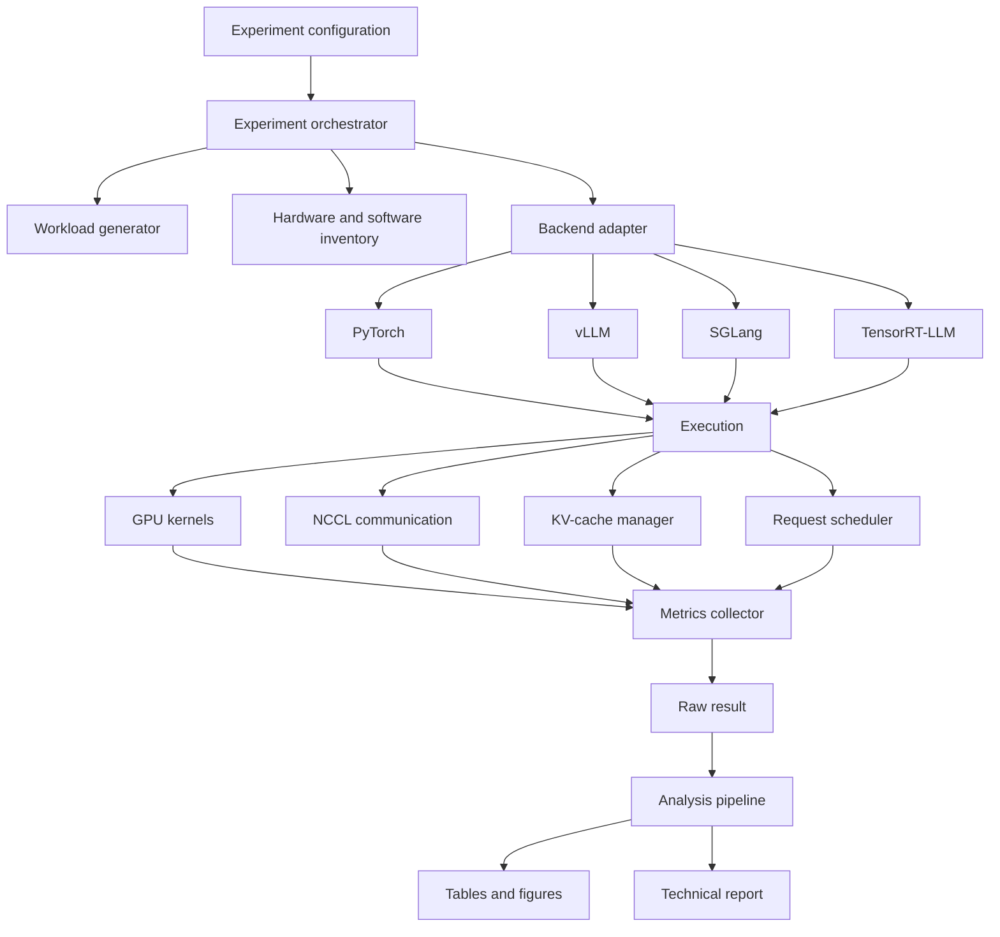
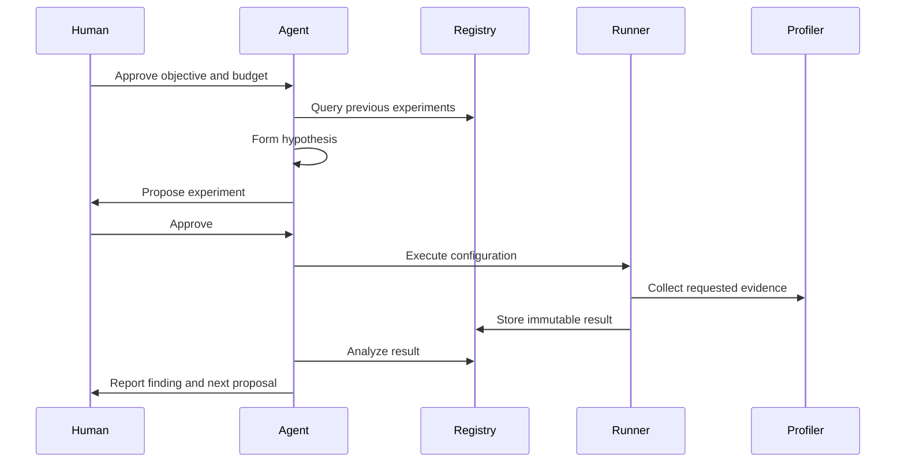

# Architecture

## Design goals

The system should make experiments:

- Reproducible
- Runtime-agnostic
- Hardware-aware
- Profiler-friendly
- Machine-readable
- Easy to compare without hiding backend-specific behavior

## Logical components



## Proposed implementation layout

```text
benchmark/
├── config.py
├── inventory.py
├── workloads.py
├── runner.py
├── metrics.py
├── schemas.py
└── analyze.py

engines/
├── base.py
├── pytorch_backend/
├── vllm_backend/
├── sglang_backend/
└── tensorrt_llm_backend/

kernels/
├── reference/
├── triton/
├── cuda/
└── tests/

quantization/
├── calibration/
├── methods/
└── evaluation/

distributed/
├── collectives/
├── tensor_parallel/
├── expert_parallel/
└── overlap/

serving/
├── router/
├── prefill/
├── decode/
├── kv_transfer/
└── simulator/

profiling/
├── nsys/
├── ncu/
└── parsers/
```

These directories should be added only when implementation begins. Empty architecture theater is less useful than a small, working vertical slice.

## Backend contract

Each backend should expose conceptually equivalent operations:

```python
class InferenceBackend:
    def prepare(self, config): ...
    def warmup(self, workload): ...
    def run(self, workload): ...
    def collect_runtime_metadata(self): ...
    def shutdown(self): ...
```

The common contract should normalize experiment control and result reporting without suppressing backend-specific capabilities.

Backend-specific settings must remain visible in configuration and results.

## Workload model

A workload should describe:

- Prompt tokens or prompt-generation rule
- Requested output length
- Arrival timestamp
- Sampling configuration
- Priority or class
- Prefix-sharing group
- Cancellation policy

Support both:

- Closed-loop load: a fixed number of concurrent clients
- Open-loop load: requests arriving according to a process such as Poisson or a trace

Closed-loop load is useful for saturation tests. Open-loop load is necessary for queueing and tail-latency analysis.

## Result model

Each run should produce:

1. Environment metadata
2. Experiment configuration
3. Per-request metrics
4. Aggregate metrics
5. Correctness results
6. Profiler artifact references
7. Runtime logs
8. Failure information

Do not store only aggregate numbers. Per-request data is needed to study distributions and tail behavior.

## Profiling modes

The orchestrator should distinguish:

- `benchmark`: minimal instrumentation for headline numbers
- `nsys`: system timeline
- `ncu`: selected-kernel analysis
- `debug`: verbose logs and assertions
- `correctness`: reduced workload with strict validation

Profiler runs should not silently replace benchmark runs because instrumentation can alter performance.

## Agentic orchestration

An agent should interact with the laboratory only through typed, auditable tools.



The agent must not modify previous raw results, conceal failed runs, or execute expensive experiments without approval.
